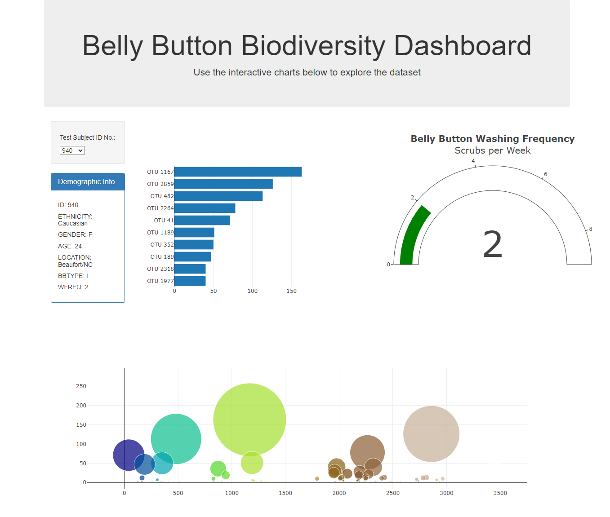

<h3>Biodiversity-Dashboard</h3>

<h5>Code Location and Related</h5>

> The Biodiversity-Dashboard skeletal code can be found by navigating to the "static/js" folder and then selecting the "app.js" file
>
> Deploy Live Website by Clicking [Here](https://elasmo4.github.io/Biodiversity-Dashboard/)
>
> 

<h5>Modules Utilized</h5>

> D3 library, Plotly
> 

<h5>Code source and usage:</h5>

> Credit: Tasha Christensen
>
> Usage: Edudcational purposes only
>
> References: Hulcr, J. et al. (2012) A Jungle in There: Bacteria in Belly Buttons are Highly Diverse, but Predictable. Retrieved from: http://robdunnlab.com/projects/belly-button-biodiversity/results-and-data/
> 
> Projects in Biodiversity-Dashboard were completed with help from tutors, which may contain outside curriculum content.

<h5>Features and Tests</h5>

> Biodiversity-Dashboard provides a clickable dashboard
> 
> Visitors should check that the dashboard displays upon launching URL
> 

<h5>Contact:</h5>

If there are any questions or concerns, I can be reached at:
> [github: elasmo4](https://github.com/elasmo4)
>
> [email: tasha.christensen44@gmail.com](mailto:tasha.christensen44@gmail.com)

<h3>Matplotlib-Challenge</h3>
<h5>Code location:</h5>

> The Pymaceuticals project can be found by selecting the "pymaceuticals.ipynb" file above.
> 
